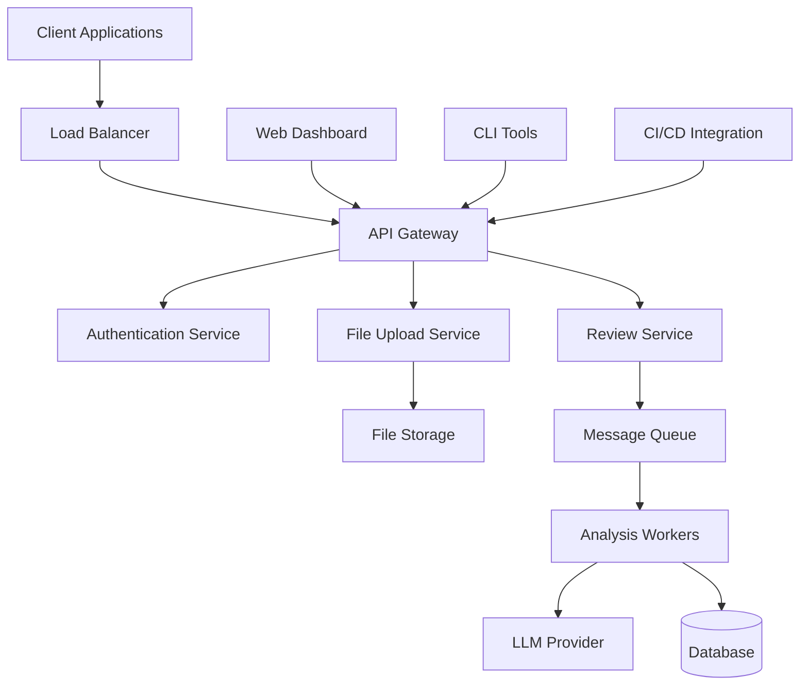
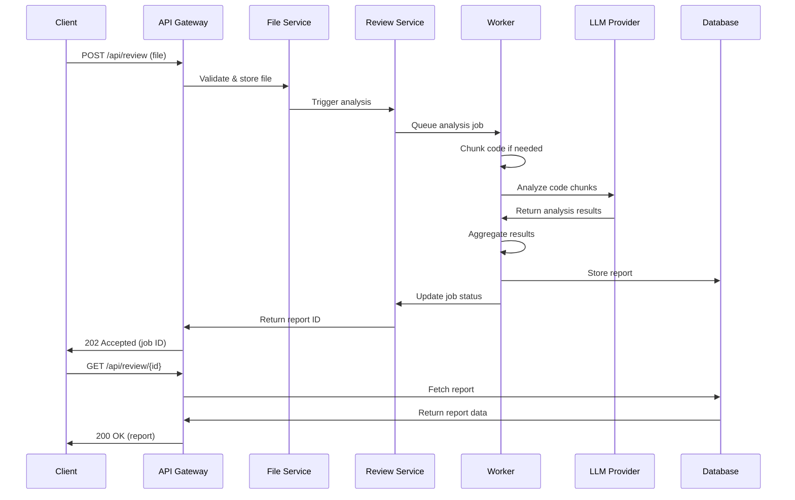

# Design Document

## Overview

The Code Review Assistant is a microservices-based system that provides automated code analysis through LLM integration. The architecture follows a layered approach with clear separation between API handling, business logic, LLM processing, and data persistence. The system is designed to handle both synchronous and asynchronous processing patterns to accommodate different file sizes and complexity levels.

## Architecture

### High-Level Architecture



### Service Architecture

The system consists of the following core services:

1. **API Gateway**: Handles routing, rate limiting, and request validation
2. **Authentication Service**: Manages API keys, JWT tokens, and user sessions
3. **File Upload Service**: Processes file uploads, validation, and storage
4. **Review Service**: Orchestrates code analysis workflow
5. **Analysis Workers**: Background processors for LLM integration
6. **Web Dashboard**: Frontend interface for interactive usage

### Processing Flow



## Components and Interfaces

### API Layer

#### REST Endpoints

```typescript
// File Upload and Review
POST /api/review
  - Body: multipart/form-data
  - Fields: file, language?, ruleset?, async?
  - Response: { report_id, status, estimated_time? }

GET /api/review/{report_id}
  - Response: { report_id, status, summary?, issues?, recommendations?, created_at }

GET /api/reviews
  - Query: page?, limit?, language?, date_from?, date_to?
  - Response: { reports: [], total, page, limit }

DELETE /api/review/{report_id}
  - Response: { success: boolean }

// Health and Status
GET /api/health
  - Response: { status, services: { db, llm, queue } }

GET /api/limits
  - Response: { max_file_size, supported_languages, rate_limits }
```

#### Authentication Interface

```typescript
interface AuthService {
  validateApiKey(key: string): Promise<User | null>
  validateJWT(token: string): Promise<User | null>
  checkRateLimit(userId: string): Promise<boolean>
  logRequest(userId: string, endpoint: string): Promise<void>
}
```

### File Processing Layer

#### File Handler Interface

```typescript
interface FileHandler {
  validateFile(file: Buffer, filename: string): ValidationResult
  extractFiles(zipBuffer: Buffer): ExtractedFile[]
  detectLanguage(filename: string, content: string): string
  sanitizeContent(content: string): SanitizedContent
}

interface ValidationResult {
  valid: boolean
  errors: string[]
  fileSize: number
  detectedType: string
}

interface ExtractedFile {
  path: string
  content: string
  language: string
  size: number
}

interface SanitizedContent {
  content: string
  redactedSecrets: RedactedSecret[]
  warnings: string[]
}
```

### LLM Integration Layer

#### LLM Service Interface

```typescript
interface LLMService {
  analyzeCode(chunk: CodeChunk, context: AnalysisContext): Promise<AnalysisResult>
  estimateTokens(content: string): number
  chunkCode(content: string, language: string): CodeChunk[]
  aggregateResults(results: AnalysisResult[]): AggregatedReport
}

interface CodeChunk {
  content: string
  startLine: number
  endLine: number
  context: string
  language: string
}

interface AnalysisContext {
  language: string
  ruleset: string[]
  focusAreas: string[]
  maxSeverity: 'low' | 'medium' | 'high'
}

interface AnalysisResult {
  summary: string
  issues: Issue[]
  recommendations: Recommendation[]
  confidence: number
  processingTime: number
}
```

#### LLM Prompt Strategy

The system uses structured prompts designed for consistent JSON output:

```typescript
const ANALYSIS_PROMPT = `
You are a senior software engineer conducting a code review. Analyze the provided code for:
1. Security vulnerabilities and risks
2. Code quality and readability issues  
3. Performance and efficiency concerns
4. Best practices and style violations
5. Modularity and maintainability improvements

Return your analysis as a JSON object with this exact structure:
{
  "summary": "Brief 2-3 sentence overview",
  "issues": [
    {
      "type": "security|bug|performance|style",
      "severity": "high|medium|low", 
      "line": number,
      "message": "Description of the issue",
      "suggestion": "Specific fix recommendation",
      "code_snippet": "Relevant code context"
    }
  ],
  "recommendations": [
    {
      "area": "readability|modularity|performance|security",
      "message": "Improvement suggestion",
      "impact": "high|medium|low",
      "effort": "high|medium|low"
    }
  ]
}
`;
```

### Data Layer

#### Database Schema

```sql
-- Users and Authentication
CREATE TABLE users (
    id UUID PRIMARY KEY,
    api_key VARCHAR(64) UNIQUE NOT NULL,
    email VARCHAR(255),
    created_at TIMESTAMP DEFAULT NOW(),
    rate_limit_tier VARCHAR(20) DEFAULT 'standard'
);

-- Review Reports
CREATE TABLE reports (
    id UUID PRIMARY KEY,
    user_id UUID REFERENCES users(id),
    filename VARCHAR(255) NOT NULL,
    language VARCHAR(50),
    file_size INTEGER,
    status VARCHAR(20) DEFAULT 'processing',
    summary TEXT,
    report_json JSONB,
    storage_path VARCHAR(500),
    created_at TIMESTAMP DEFAULT NOW(),
    completed_at TIMESTAMP,
    processing_time_ms INTEGER
);

-- Issues extracted from reports for querying
CREATE TABLE issues (
    id UUID PRIMARY KEY,
    report_id UUID REFERENCES reports(id),
    type VARCHAR(50),
    severity VARCHAR(10),
    line_number INTEGER,
    message TEXT,
    suggestion TEXT,
    created_at TIMESTAMP DEFAULT NOW()
);

-- Rate limiting and usage tracking
CREATE TABLE api_usage (
    id UUID PRIMARY KEY,
    user_id UUID REFERENCES users(id),
    endpoint VARCHAR(100),
    timestamp TIMESTAMP DEFAULT NOW(),
    response_time_ms INTEGER,
    status_code INTEGER
);

-- Indexes for performance
CREATE INDEX idx_reports_user_created ON reports(user_id, created_at DESC);
CREATE INDEX idx_reports_status ON reports(status);
CREATE INDEX idx_issues_report_severity ON issues(report_id, severity);
CREATE INDEX idx_api_usage_user_timestamp ON api_usage(user_id, timestamp);
```

## Data Models

### Core Domain Models

```typescript
interface User {
  id: string
  apiKey: string
  email?: string
  rateLimitTier: 'basic' | 'standard' | 'premium'
  createdAt: Date
}

interface Report {
  id: string
  userId: string
  filename: string
  language: string
  fileSize: number
  status: 'processing' | 'completed' | 'failed'
  summary?: string
  issues: Issue[]
  recommendations: Recommendation[]
  storagePath: string
  createdAt: Date
  completedAt?: Date
  processingTimeMs?: number
}

interface Issue {
  id: string
  type: 'security' | 'bug' | 'performance' | 'style' | 'maintainability'
  severity: 'high' | 'medium' | 'low'
  line: number
  message: string
  suggestion: string
  codeSnippet?: string
  confidence: number
}

interface Recommendation {
  area: 'readability' | 'modularity' | 'performance' | 'security' | 'testing'
  message: string
  impact: 'high' | 'medium' | 'low'
  effort: 'high' | 'medium' | 'low'
  examples?: string[]
}
```

## Error Handling

### Error Classification

```typescript
enum ErrorType {
  VALIDATION_ERROR = 'VALIDATION_ERROR',
  FILE_TOO_LARGE = 'FILE_TOO_LARGE', 
  UNSUPPORTED_FORMAT = 'UNSUPPORTED_FORMAT',
  LLM_SERVICE_ERROR = 'LLM_SERVICE_ERROR',
  RATE_LIMIT_EXCEEDED = 'RATE_LIMIT_EXCEEDED',
  AUTHENTICATION_FAILED = 'AUTHENTICATION_FAILED',
  INTERNAL_SERVER_ERROR = 'INTERNAL_SERVER_ERROR'
}

interface ErrorResponse {
  error: {
    type: ErrorType
    message: string
    details?: any
    retryAfter?: number
  }
  requestId: string
  timestamp: string
}
```

### Error Handling Strategy

1. **Input Validation Errors**: Return 400 with specific validation messages
2. **Authentication Errors**: Return 401 with clear authentication requirements  
3. **Rate Limiting**: Return 429 with retry-after header
4. **LLM Service Errors**: Implement exponential backoff with circuit breaker
5. **File Processing Errors**: Graceful degradation with partial results
6. **Database Errors**: Automatic retry with fallback to cached responses

### Circuit Breaker Pattern

```typescript
interface CircuitBreaker {
  state: 'CLOSED' | 'OPEN' | 'HALF_OPEN'
  failureCount: number
  lastFailureTime: Date
  timeout: number
  
  execute<T>(operation: () => Promise<T>): Promise<T>
  onSuccess(): void
  onFailure(): void
}
```

## Testing Strategy

### Unit Testing

- **File Processing**: Test validation, extraction, and sanitization logic
- **LLM Integration**: Mock LLM responses to test parsing and aggregation
- **API Endpoints**: Test request/response handling and error cases
- **Database Operations**: Test CRUD operations and query performance

### Integration Testing

- **End-to-End Workflows**: Upload → Process → Retrieve complete flows
- **LLM Provider Integration**: Test with real LLM APIs using test accounts
- **Database Integration**: Test with real database using test data
- **Authentication Flow**: Test API key and JWT validation

### Performance Testing

- **Load Testing**: Simulate concurrent uploads and processing
- **Stress Testing**: Test system behavior under high load
- **File Size Testing**: Test with various file sizes up to limits
- **Memory Usage**: Monitor memory consumption during large file processing

### Security Testing

- **Input Validation**: Test malicious file uploads and injection attempts
- **Secret Detection**: Verify redaction of API keys, passwords, tokens
- **Authentication**: Test unauthorized access attempts
- **Data Encryption**: Verify encryption at rest and in transit

### Test Data Strategy

```typescript
// Test fixtures for consistent testing
const TEST_FILES = {
  PYTHON_SIMPLE: 'test/fixtures/simple.py',
  PYTHON_WITH_ISSUES: 'test/fixtures/security_issues.py', 
  JAVASCRIPT_LARGE: 'test/fixtures/large_project.zip',
  INVALID_BINARY: 'test/fixtures/image.png'
}

const MOCK_LLM_RESPONSES = {
  CLEAN_CODE: { summary: 'Good code quality', issues: [], recommendations: [] },
  WITH_SECURITY_ISSUES: { /* predefined security issues */ },
  WITH_PERFORMANCE_ISSUES: { /* predefined performance issues */ }
}
```

This design provides a robust, scalable foundation for the Code Review Assistant that addresses all the requirements while maintaining flexibility for future enhancements.